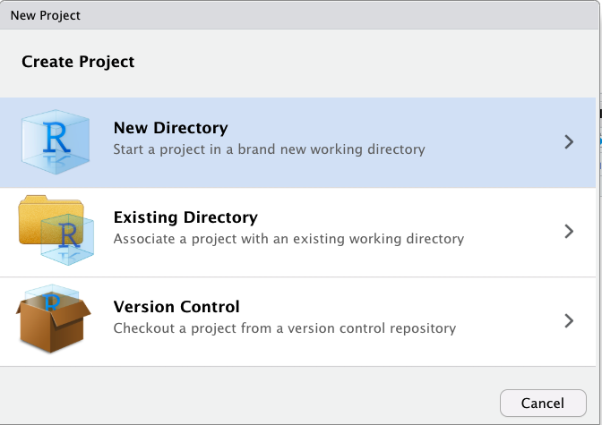
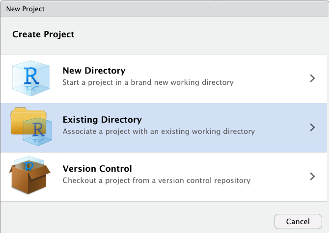

---
# Please do not edit this file directly; it is auto generated.
# Instead, please edit 01-Intro.md in _episodes_rmd/
title: "Introduction to RStudio with Git"
teaching: 45
exercises: 10
questions:
- "Where are the Git controls in RStudio?"
- "Where do I begin for a brand-new R project?"
- "How do I clone and work on an R project from Github?"
- "How do I take an existing R project and turn it into a Git repository?"
objectives:
- "Explore the git features in RStudio"
- "Use git from the RStudio command line"
keypoints:
- "RStudio's Git integration is an alternative way to use some of the Git commands"
- "RStudio's Git integration doesn't do everything in Git; some work in the Terminal pane is often necessary"
- "The workflow for setting up a project in RStudio differs depending on whether it's a pre-existing Github repository or not"
source: Rmd
---

In [Version Control With Git](http://swcarpentry.github.io/git-novice/), we saw some of the potential benefits of using a version control system such as Git to track changes and manage versions of our files.  We also saw that connecting your Git repository to a remote such as Github allows us to collaborate with others, share your code, to store a duplicate copy of your repository somewhere other than your laptop, and to gain other benefits as well.

### Bringing RStudio into the picture

Now let's consider a project we're working on that involves R code.  We certainly *can* manage our code files as a git/Github repository entirely from the command line, whether via the RStudio terminal or completely outside of RStudio -- and that would work just fine.  However, RStudio has a built-in Git integration that you may find more convenient for some (but not all) of the typical Git workflow steps.  It's worth our giving RStudio's git features a try, and you can decide which combination of RStudio features and command-line git you prefer.

## Where are you starting from?

There are three basic scenarios you might be starting from:

1. A blank slate.
2. You have an RStudio project on your computer, but it's not a Git repository.
3. There is a Github repository with some R code that you'd like to clone, work on, and perhaps contribute back to.

### Blank slate

Let's take the blank slate scenario.  First we create a new project:

> ## Do You See a "Version Control" Option?
>
> Although we're not going to use it here, there should be a "version control"
> option on this menu. That is what you would click on if you wanted to
> create a project on your computer by cloning a repository from GitHub.
> If that option is not present, it probably means that RStudio doesn't know
> where your Git executable is, and you won't be able to progress further
> in this lesson until you tell RStudio where it is.  
> ### Find your Git Executiable
> First let's make sure that Git is installed on your computer.
> Open your shell on Mac or Linux, or on Windows open the command prompt
> and then type:
> - `which git` (Mac, Linux)
> - `where git` (Windows)
>
> If there is no version of Git on your computer, 
please follow the 
[Git installation 
instructions](https://swcarpentry.github.io/git-novice/setup.html)
> in the setup of this lesson to install Git now. Next open your shell or command prompt 
> and type `which git` (Mac, Linux), or `where git` (Windows).
> Copy the path to the git executable.
>
> e.g. On one Windows computer which had GitHub Desktop installed on it, the path was:
> `C:/Users/UserName/AppData/Local/GitHubDesktop/app-1.1.1/resources/app/git/cmd/git.exe`
> 
> NOTE: The path on your computer will be somewhat different.
> ### Tell RStudio where to find GitHub
> In RStudio, go to the `Tools` menu > `Global Options` > `Git/SVN` and then
> browse to the git executable you found in the command prompt or shell. Now restart
> RStudio.
> Note: Even if you have Git installed, you may need
> to accept the XCode license if you are using macOS.
{: .callout}

Also note that there's now a Git tab in the upper right pane, next to "Environment" and "History".

Next, we select "New Directory":

More text here

### Existing Project

This will open a dialog asking us how we want to create the project. We have
some options here. Let's say that we want to use RStudio with the planets
repository that we already made. Since that repository lives in a directory on
our computer, we choose the option "Existing Directory":

Next, RStudio will ask which existing directory we want to use. Click
"Browse..." and navigate to the correct directory, then click "Create Project":

Ta-da! We have created a new project in RStudio within **FIXME** the existing planets
repository. Notice the vertical "Git" menu in the menu bar. RStudio has
recognized that the current directory is a Git repository, and gives us a
number of tools to use Git:

